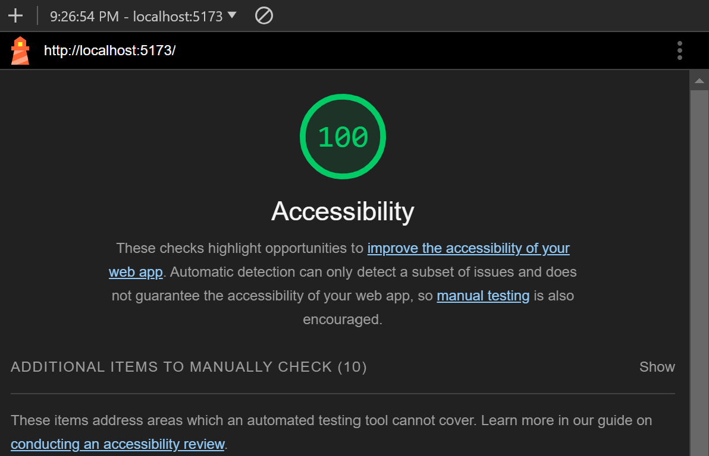
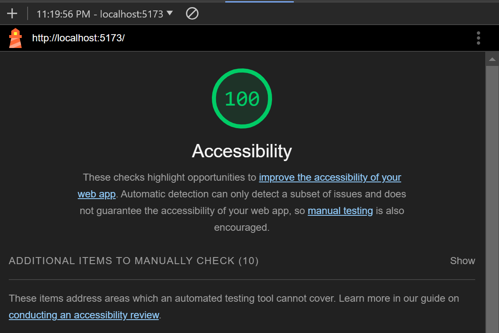

# React + Vite

This template provides a minimal setup to get React working in Vite with HMR and some ESLint rules.

Currently, two official plugins are available:

- [@vitejs/plugin-react](https://github.com/vitejs/vite-plugin-react/blob/main/packages/plugin-react/README.md) uses [Babel](https://babeljs.io/) for Fast Refresh
- [@vitejs/plugin-react-swc](https://github.com/vitejs/vite-plugin-react-swc) uses [SWC](https://swc.rs/) for Fast Refresh

[lab-02-lighthouse](lab-02-lighthouse.png)

Number and name of feature: Feature #1: Display Images

Estimate of time needed to complete: 3 hours

Start time: 9pm

Finish time: 12pm

Actual time needed to complete: 4 hours

Number and name of feature: Feature #2: Allow Users to Favorite Individual Beasts

Estimate of time needed to complete: 30 mins

Start time: 2:30pm

Finish time: 3:00pm

Actual time needed to complete: 1 hour

Number and name of feature: Feature 3: Bootstrap

Estimate of time needed to complete: 3 hours

Start time: 9pm

Finish time: 12pm

Actual time needed to complete: 4 hours

Number and name of feature: Feature 4: Display a Modal

Estimate of time needed to complete: 2 hours

Start time: 7pm

Finish time: 9pm

Actual time needed to complete: 2 hours

Number and name of feature: Feature 5:Filter by Numbers of Horns

Estimate of time needed to complete: 2 hours

Start time: 10pm

Finish time: 11:20pm

Actual time needed to complete: 1 hour 20 minutes